# 水印嵌入实验报告 

## 概述	

### 理论部分

* 本次实验参考了以下两篇论文：</br>

	1. 叶闯，沈益青，李豪，曹思汗，王柏祥 **[《基于人类视觉特性（HVS）的离散小波变换（DWT）数字水印算法》](http://www.cqvip.com/qk/93037a/201302/45095325.html)** 浙江大学学报 引用次数63</br>
	2. LEWIS A S，KNOWLES G.[**Image compresion using the 2-D wavelet transform**](https://ieeexplore.ieee.org/abstract/document/136601)[J].IEEE Transactions on Image Processing，1992，1(2):244-250. 引用次数**1218**，就在写实验报告期间又增加了一次引用……</br>

* 小波变换是“在时频的联合域上”对信号进行分析，简单来说，就是傅立叶变换只能体现信号在某一段时间内的频率组成，短时傅里叶虽然依靠“加窗”分时间段进行傅立叶变换，在一定程度上弥补了这一不足，但是“窗口”的大小很难把控，如果大了弱点就没有解决，小了又可能出现新的问题，即分析的频率不准确。所以直接上小波变换。顾名思义，不再把信号拆解成三角函数，而是拆解成小波。这篇[博客](https://blog.csdn.net/yq_forever/article/details/55253022)讲得很通俗易懂。

* Arnold置换存在也增强了安全性，因为提取出的水印在经过逆置换以前仍然是没有可读性的乱码，即便Arnold置换的算法十分简练，置乱的次数也勉强能算是个密钥了。

* 总体来讲，人对于噪声的觉察，是图片越亮的地方越不敏感、与纹理有关的系数在局部越活跃（我个人理解就是纹理越乱）越不敏感。而明度和纹理信息都主要由低频系数包含。

* 小波变换的低频带积聚了图片主要能量，大概可以理解为低频包含了主要信息，这一部分也就是其它操作比如滤波等等不容易影响到的。因此，在嵌入水印时根据计算的JND决定对DWT系数改变多少，就在保证鲁棒性的基础上增强了不可见性。

### 实验部分
* 实验环境：Python 3.6.4 使用python的skimage和numpy处理图片数据，pywt完成小波变换相关操作

## 实验中遇到的问题
* 论文中涉及公式的地方都很简洁，但并不明了，增加了很多理解和实现上的难度。
	1. 对二级DWT的低频子带（对每个8\*8的块而言，是2\*2的）只写了“升序排列”，没有具体说是不是把2M*2M（我使用的M是64）个系数直接进行从小到大排序。以至于，在加入了排序这一操作后效果更糟糕。
	2. 指出每个位置的JND如何计算的公式，看，不，懂。其实看不懂也能直接加和，问题在于效果不好。
* 用python来完成实验的优点是，matlab可以卸载了！缺点是，如果对数据的类型及其变化不够敏感，遇到类似如下报错将消耗大量的调试时间：

	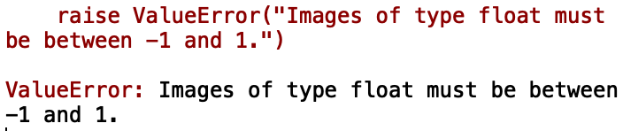


## Arnold置乱

### 流程及结果：

* 原图：

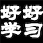

* 在【置乱.py】中进行了36次Arnold置换，将其变为：

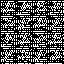

* 在【逆置乱.py】中进行了36次Arnold逆置换， 逆置换得到原图，成功：

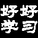

### 细节：

* 以float格式读入水印图片后，转换为灰度图像，并对其进行二值化（同时也就完成了数据类型的转换，float变int），让水印图像的像素值是0或255：

	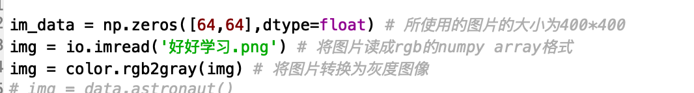


* 而后根据公式完成置乱，此处进行36次，注意每次置乱后都需要将图片变为uint8类型存储。

	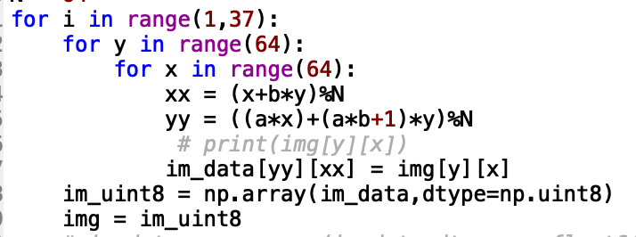
   
* 逆置乱同理

	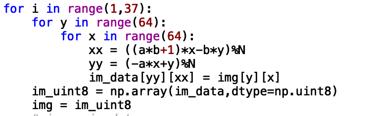
	
* 由于io操作也可能会细微地影响到图像的像素值，比如0变成1、255变254等，在逆置换之前选了160作为分界，确保像素值只能是0或255。

## 嵌入水印

* 首先，将512\*512(8M*8M,M=64）的宇航员图片分成8\*8的小块，对每一块进行两次小波变换。由于计算JND时需要用到三级DWT的系数，所以完成三次小波变换，并将系数都存起来：

	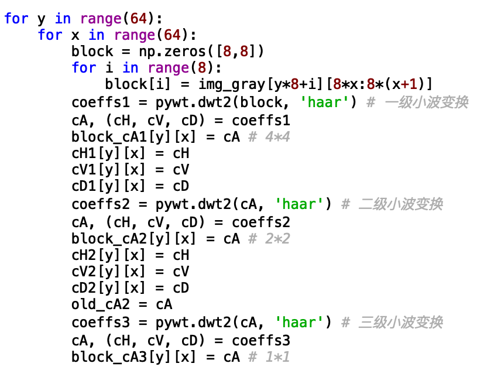
	
	
* 然后，将2M*2M的二级DWT低频子带的每个横纵坐标对和对应位置的系数以对象的形式存起来：

   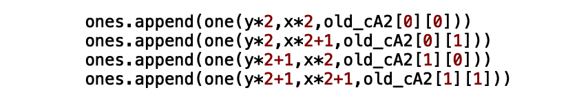

* 再对其进行升序排列：

```bash
from operator import attrgetter 
ones.sort(key=attrgetter('c')) # 按c属性的大小进行排序
```
* 在重构图片之前，将系数排序回原先的位置顺序：

```bash
ones.sort(key=attrgetter('y','x')) 
```

* 根据新的DWT系数重构图片：

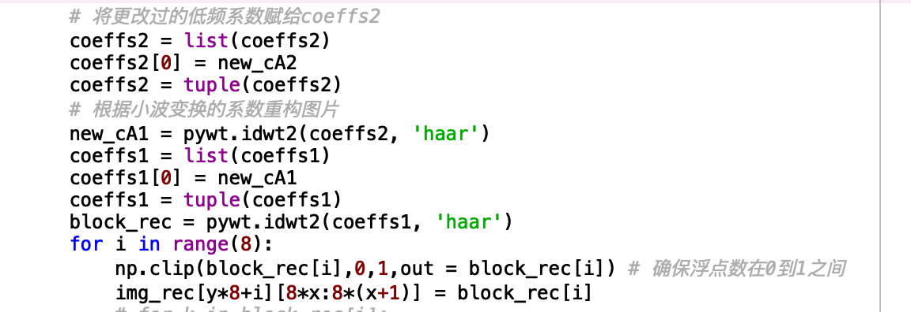


* 嵌入阶段，根据Arnold置乱后的64*64二值水印图像每个像素的值，和对应位置的DWT系数及其JND值决定增减多少。每个2\*2中，计算第一行的两个系数之差和第二行的两个系数之差，选择差值较小的一对系数进行改动，并用mark数组记录这一选择。提取时根据mark判断从哪一行提取。这里选用没有加入“排序”这一步骤时代码的嵌入部分，比较直观：

 	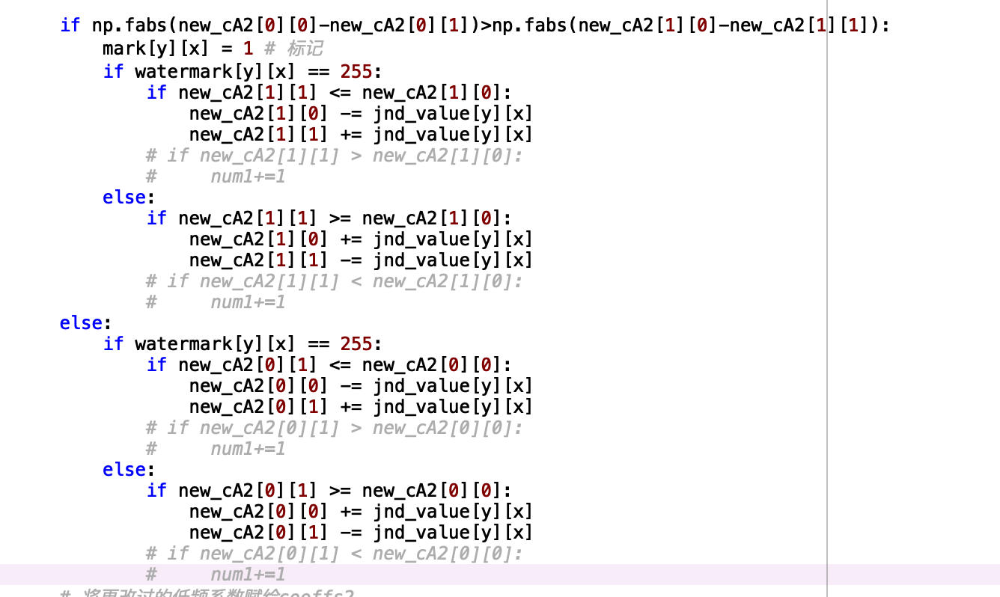
 	
* 具体效果可以从public的仓库skimage目录中的[基于人类视觉特性的离散小波变换](https://github.com/shielding/skimage_start/tree/master/%E5%9F%BA%E4%BA%8E%E4%BA%BA%E7%B1%BB%E8%A7%86%E8%A7%89%E7%89%B9%E6%80%A7%E7%9A%84%E7%A6%BB%E6%95%A3%E5%B0%8F%E6%B3%A2%E5%8F%98%E6%8D%A2)下载代码直接运行。其中pywt\_with\_sort.py加入了自己理解的排序过程。


## 优化
* 算法是先将系数进行了升序排序之后才利用两个系数之间的大小关系完成嵌入，这意味着其实每对系数的大小关系是固定的，前者小于等于后者，所以为了降低复杂度，只需要对嵌入后需要是前者大于后者的进行改动即可，其它保持不变。代码中就是这样处理的。

## 反思
* 由于选择的本篇论文中关键的求JND的公式没有详细解释，自己进行了猜测和简化才将糟糕的效果变得稍微好一点。如果时间充裕，推测可以使用规模更大的块来分析出相关公式的设计模式，因为8\*8的块无法再进行更多次的小波变换了，效果也不如大的图片一目了然。
* 本文的算法中，我认为排序是一个不错的、具有普适性的方法，虽然具体排序方式并没有指明，但直观地去看也可以理解，排序后的系数对之间差距更小，水印是通过对每个系数加减JND参数来嵌入的，系数对间的差距小意味着水印嵌入的正确率高。也许这一方法可以迁移到其它非空域甚至空域的水印算法中。
